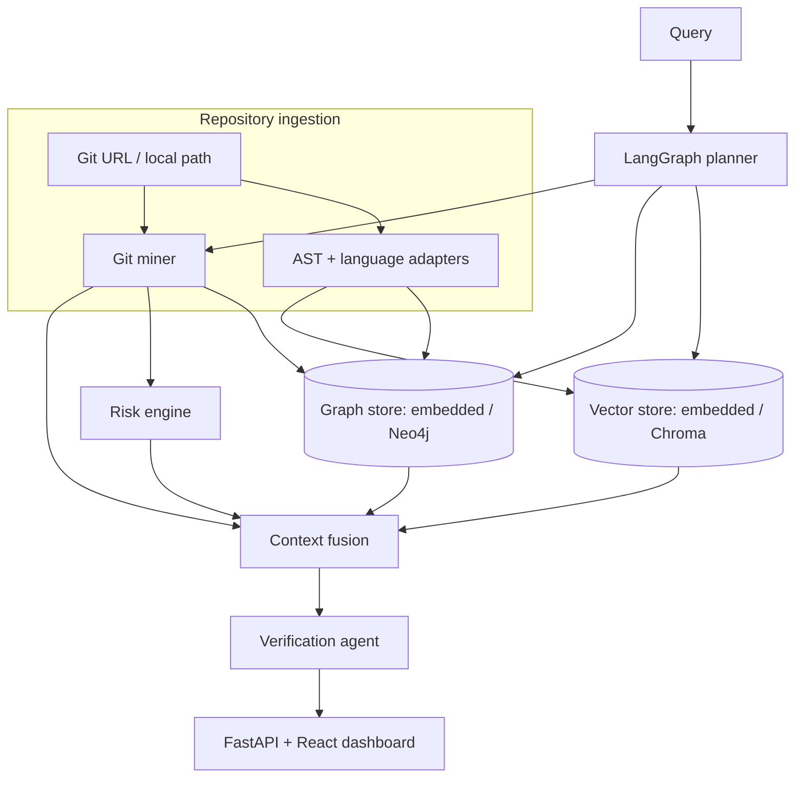

# RepoMind-X Technical Report

## Abstract

RepoMind-X is an evidence-first repository intelligence platform that integrates static program analysis, vector retrieval, knowledge-graph traversal, Git evolution mining, security scanning, and risk prediction. Its purpose is to answer repository questions from structural and historical evidence rather than from isolated code snippets.

## Introduction

Conventional retrieval-augmented code assistants often lose call relationships, dependency direction, and evolutionary context. RepoMind-X uses a hybrid retrieval policy: semantic search identifies likely code regions; the graph expands those regions through `DEFINES`, `IMPORTS`, and `CALLS`; Git history supplies authorship and modification evidence; a verification stage only cites entities resolved by the index.

## Methodology

1. **Ingestion** accepts a local checkout or public Git URL, excludes generated/vendor folders, detects Python source, and creates an immutable indexing summary.
2. **Understanding** parses Python ASTs to extract imports, classes, methods, function signatures, annotations, decorators, docstrings, call expressions, and cyclomatic-complexity approximation. The `PythonAnalyzer` is intentionally isolated behind an analyzer boundary so Tree-sitter adapters for TypeScript, Java, C++, and Java can be added without changing the graph contract.
3. **Graph construction** makes Repository, File, Class, Function and Library entities first-class. Call edges are resolved conservatively from parsed call names; ambiguous dynamic calls remain uncited rather than guessed.
4. **Hybrid retrieval** scores semantic documents and expands named hits through bounded breadth-first graph traversal. The embedded hash-vector implementation makes the demo self-contained; Chroma/BGE or CodeBERT adapters are the production target.
5. **Evolution and risk** mines Git commits and contributors per file. Function risk combines complexity, called-dependency count, modification frequency, contributor count, and nearby security findings on a 0–100 scale. A Random Forest/XGBoost model can replace this calibrated heuristic after labelled historical defects are collected.

## Architecture

The LangGraph topology is `planner → retrieval → reasoning → verification`. Current default responses use deterministic orchestration to remain operational without provider credentials; `agent_graph.py` exposes the equivalent LangGraph topology for an LLM-enabled deployment.

## API

| Endpoint | Purpose |
| --- | --- |
| `POST /api/repositories/ingest` | Index a local path or public Git URL |
| `GET /api/repositories/{id}/graph` | Return graph nodes and edges for React Flow |
| `GET /api/repositories/{id}/impact?symbol=...` | Traverse downstream structural impact |
| `GET /api/repositories/{id}/findings` | Return security findings |
| `POST /api/query` | Run hybrid query and return grounded evidence |
| `POST /api/repositories/{id}/memory` | Persist a repository-scoped note for the process lifetime |

## Experiments and evaluation

Evaluation uses repository-specific questions with annotated relevant symbols, dependencies, claims, and citations. Compare vector-only, graph-only, and hybrid modes on retrieval accuracy, dependency accuracy, answer correctness, citation accuracy, and latency. The aggregate Repository Understanding Score is:

`RUS = 0.3R + 0.3D + 0.2E + 0.2C`

where `R` is retrieval accuracy, `D` dependency accuracy, `E` explanation correctness, and `C` citation accuracy. `EvaluationMetrics` implements this metric and unit tests verify the formula.

## Limitations and future work

Current source parsing is Python-first and call resolution is deliberately conservative. Planned production extensions include Tree-sitter multi-language adapters, Neo4j persistence, Chroma/BGE embeddings, PostgreSQL conversation memory, CodeQL/Semgrep workers, PR and issue-provider connectors, calibrated XGBoost risk scores, background re-indexing, access control, and benchmark datasets.
